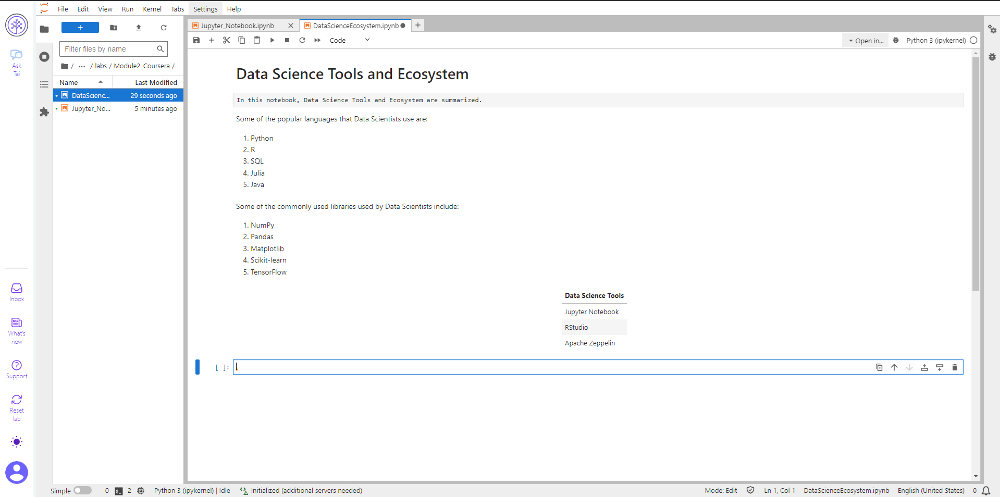
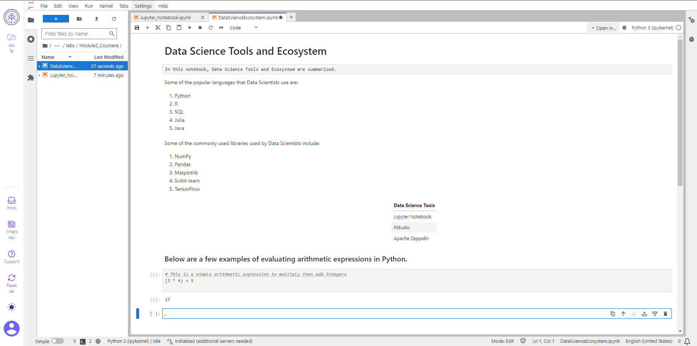
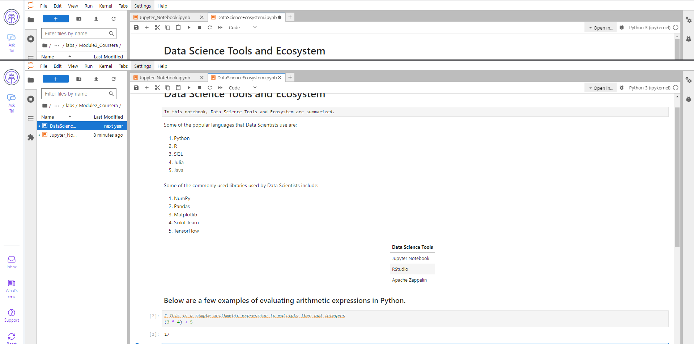
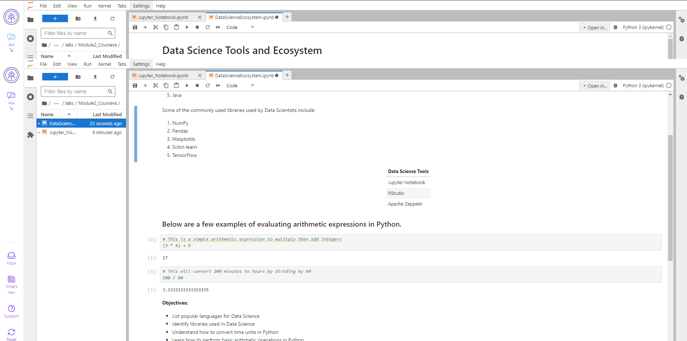
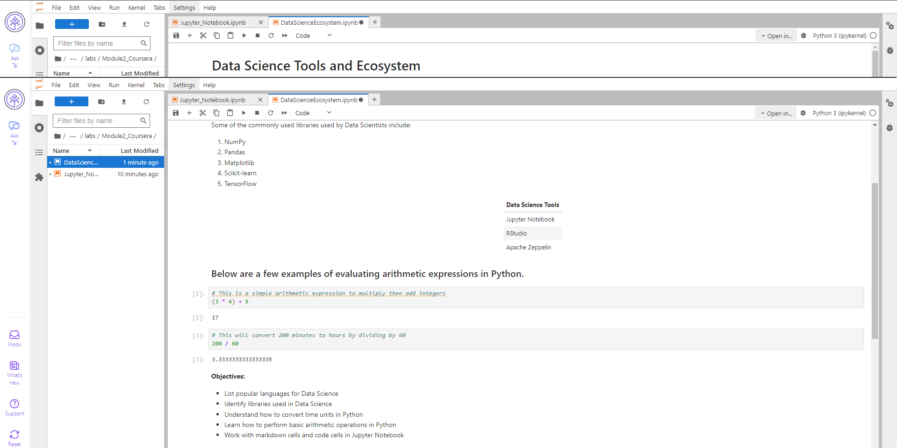

# Data Science Tools and Ecosystem

## Introduction

In this notebook, Data Science Tools and Ecosystem are summarized.

## Objectives

**Objectives:**

- List popular languages for Data Science.
- List commonly used libraries in Data Science.
- Understand the arithmetic operations and their implementations in Python.
- Learn how to upload a notebook to GitHub.

## Exercises

### Exercise 1 - Create a markdown cell with title of the notebook
Below is the screenshot for creating a title in the notebook.

### Exercise 2 - Create a markdown cell for an introduction
This is the screenshot for the introduction markdown cell.

### Exercise 3 - Create a markdown cell to list data science languages
Below is the screenshot for listing data science languages.

### Exercise 4 - Create a markdown cell to list data science libraries
This is the screenshot showing the libraries used in data science.

### Exercise 5 - Create a markdown cell with a table of Data Science tools
Below is the screenshot of the table showing Data Science tools.

### Exercise 6 - Create a markdown cell introducing arithmetic expression examples
This is the markdown cell that introduces arithmetic expressions.

### Exercise 7 - Create a code cell to multiply and add numbers
Below is the screenshot of the code cell to multiply and add numbers.

### Exercise 8 - Create a code cell to convert minutes to hours
This is the screenshot for the code that converts minutes to hours.

### Exercise 9 - Insert a markdown cell to list Objectives
Below is the screenshot listing the objectives of the notebook.

### Exercise 10 - Create a markdown cell to indicate the Author's name
Here is the screenshot showing the author's name in markdown.

## Author

**Author:**  
Murilo Luiz Calore Ritto
